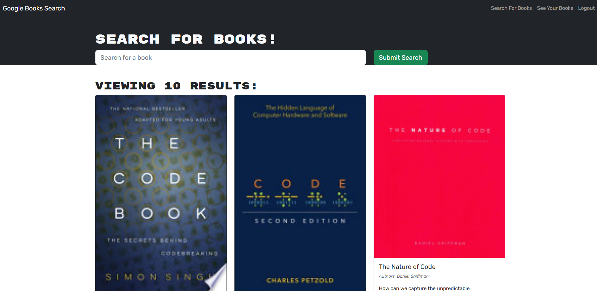

  
  # Book Finder

  ## Description

 This project is an exciting exploration of GraphQL, featuring user authentication and dynamic interactions with MongoDB. It allows users to search for books, add them to their favorites list, and remove them from the list as needed. The application heavily utilizes GraphQL for handling database operations, making it a great showcase of its capabilities in building modern web applications.

  ## Table of Contents

  - [Installation](#installation)
  - [Usage](#usage)
  - [License](#license)
  - [Questions](#questions)

  ## Installation

  npm run install -> npm run dev

  ## Usage

  Just follow the link at https://bookfinder.herokuapp.com/
  

  ## License

  This application is covered under the MIT license. Read more at [License: MIT](https://opensource.org/licenses/MIT)

  ## Questions

  1. Where can I find your github so that I can view your other projects? https://github.com/scicluna

  2. What email address should I use to contact you regarding further opportunities or questions? sciclunajl@gmail.com
